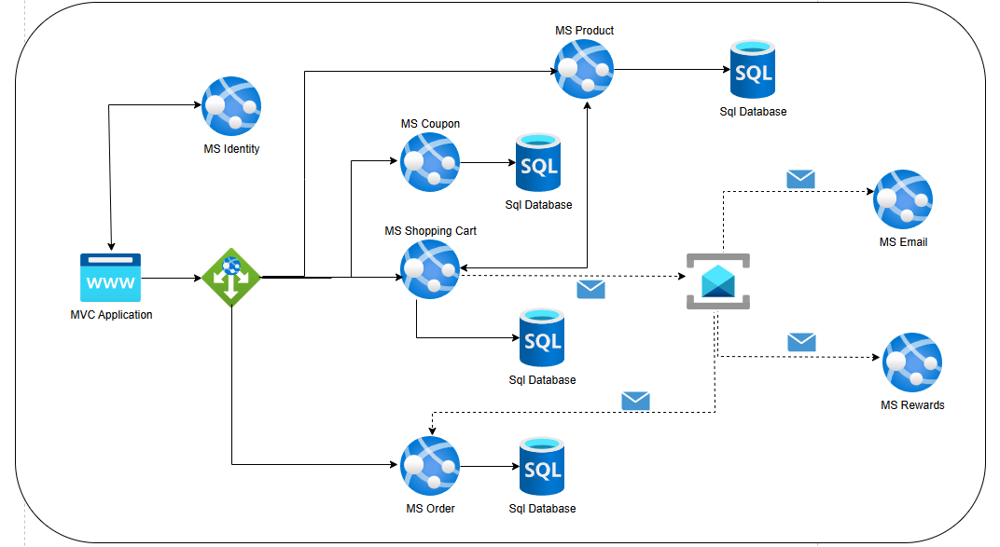

# .NET 8 Microservices E-Commerce 

> Solucion de comercio electronico basada en **microservicios** construida con **.NET 8**, **ASP.NET Core MVC**, **Entity Framework Core**, **.NET Identity**, **Ocelot API Gateway** y **Azure Service Bus**.

---

## Descripcion general

Este repositorio contiene una **aplicacion de e-commerce basada en microservicios**, disenada para practicar y demostrar patrones modernos de arquitectura con **.NET 8**.

La solucion esta compuesta por varios microservicios desplegables de forma independiente, una **aplicacion cliente MVC**, un **API Gateway** y mensajeria **asincronica con Azure Service Bus**.

Los objetivos principales del proyecto son:

- Aplicar una **arquitectura de microservicios limpia**, con limites bien definidos.
- Implementar **autenticacion y autorizacion** con **.NET Identity** y **control de acceso basado en roles**.
- Demostrar **comunicacion sincrona (HTTP)** y **asincronica (eventos/mensajes)** entre servicios.
- Utilizar **Azure Service Bus (Queues & Topics)** para flujos desacoplados y dirigidos por eventos.
- Implementar **arquitectura en capas (N-Layer)** con **Repository Pattern** y **Entity Framework Core**.
- Exponer APIs REST usando **Swagger / OpenAPI**.
- Construir un front-end **ASP.NET Core MVC** con **Bootstrap 5** como capa de UI.

---

## Diagrama de infraestructura

---

## Microservicios

### 1. Identity Microservice (`MS.Identity`)
- Maneja **registro**, **inicio de sesion** y **gestion de usuarios**.
- Implementa **.NET Identity** para autenticacion y autorizacion.
- Emite **tokens JWT** consumidos por la aplicacion MVC y otros microservicios a traves del gateway.
- Soporta **autorizacion basada en roles** (por ejemplo, `Admin`, `Customer`).

### 2. Product Microservice (`MS.Product`)
- Administra el **catalogo de productos**.
- Operaciones CRUD (crear, actualizar, listar, eliminar).
- Usa **Entity Framework Core** con **SQL Server**.
- Expone APIs REST consumidas por el carrito de compras y la aplicacion MVC.

### 3. Coupon Microservice (`MS.Coupon`)
- Gestiona **cupones / codigos de descuento**.
- Valida cupones y calcula descuentos.
- Utiliza una base de datos independiente en **SQL Server**.
- Es consumido por el microservicio de **Shopping Cart** para aplicar descuentos.

### 4. Shopping Cart Microservice (`MS.ShoppingCart`)
- Gestiona el **carrito de compras** de cada usuario.
- Se integra con:
  - **Product Service** para obtener detalles y precios de productos.
  - **Coupon Service** para validar y aplicar cupones.
- Persiste informacion usando **EF Core + SQL Server**.
- Publica **eventos de pedido** en **Azure Service Bus** cuando se realiza el checkout.

### 5. Order Microservice (`MS.Order`)
- Se encarga de la **creacion y gestion de pedidos**.
- Recibe peticiones desde el **Shopping Cart** (via Gateway) o escucha eventos.
- Almacena pedidos en su propia base de datos **SQL Server**.
- Publica eventos en **Azure Service Bus** para que **Email** y **Rewards** procesen acciones de forma asincronica.

### 6. Email Microservice (`MS.Email`)
- Suscrito a mensajes de **Azure Service Bus** (por ejemplo, eventos de ¡§Order Created¡¨).
- Envia **correos de confirmacion de pedido** a los clientes.
- Totalmente desacoplado del microservicio de pedidos.

### 7. Rewards Microservice (`MS.Rewards`)
- Escucha eventos de pedidos en Azure Service Bus.
- Calcula y aplica **puntos de recompensa / fidelidad** al usuario.
- Mantiene su propia base de datos **SQL Server**.

---

## API Gateway y aplicacion cliente

### Ocelot API Gateway
- Punto de entrada central para todas las **peticiones del cliente**.
- Encargado de enrutar las solicitudes HTTP al microservicio correspondiente.
- Se ocupa de:
  - Routing
  - Agregacion de respuestas
  - Encadenar y reenviar tokens de autenticacion
- Simplifica el cliente MVC al ocultar la complejidad de los microservicios tras una sola URL.

### ASP.NET Core MVC Application
- Construida con **ASP.NET Core MVC (.NET 8)** y **Bootstrap 5**.
- Implementa la UI de e-commerce (catalogo, carrito, checkout, login, etc.).
- Se comunica **unicamente** con el **Ocelot Gateway**.
- Utiliza **Cookies + JWT** e **Identity** para escenarios autenticados.

---

## Seguridad

- **.NET Identity** para gestion de usuarios y roles.
- **Autenticacion basada en JWT** para llamadas seguras a las APIs.
- **Autorizacion basada en roles** a nivel de controlador y accion.
- Operaciones sensibles (gestion de productos, listado de todos los pedidos, etc.) restringidas a usuarios administradores.

---

## Patrones de comunicacion

### Comunicacion sincrona
- Basada en **HTTP/REST** a traves del **Ocelot Gateway** para:
  - Consultas de productos
  - Operaciones del carrito
  - Validacion de cupones
  - Consultas de pedidos

### Comunicacion asincronica
- Basada en **Azure Service Bus (Queues & Topics)** para:
  - Eventos de creacion de pedidos
  - Notificaciones por correo
  - Procesamiento de puntos/recompensas

Beneficios:
- Microservicios desacoplados.
- Mensajeria confiable.
- Mayor resiliencia y escalabilidad.

---

## Datos y persistencia

Cada microservicio es dueno de su **propia base de datos**, siguiendo el patron **Database-per-Microservice**:

- **SQL Server** para todos los microservicios.
- **Entity Framework Core** como ORM.
- **Migrations** para evolucionar el esquema de cada servicio de forma independiente.
- No se comparten bases de datos entre microservicios, evitando acoplamientos innecesarios.

---

## Tecnologias y herramientas

- **Backend**
  - .NET 8
  - ASP.NET Core MVC
  - ASP.NET Core Web API
  - .NET Identity
  - Entity Framework Core
  - Ocelot API Gateway
  - Swagger / OpenAPI

- **Mensajeria**
  - Azure Service Bus (Queues & Topics)

- **Base de datos**
  - SQL Server
  - EF Core Migrations

- **Frontend**
  - ASP.NET Core MVC Views
  - Bootstrap 5

- **Arquitectura y patrones**
  - Arquitectura de microservicios
  - Database-per-Microservice
  - Arquitectura en capas (N-Layer)
  - Repository Pattern
  - Comunicacion dirigida por eventos

---

## Roadmap / Posibles mejoras

- Implementar **logging centralizado** (Serilog + ELK / Seq).
- Anadir **versionado de APIs** y **rate limiting**.
- Incorporar **OpenTelemetry** para trazabilidad distribuida.
- Unit Test.

---

## Sobre el autor

Este proyecto forma parte de un proceso practico para dominar **microservicios con .NET 8**, poniendo enfasis en:

- Patrones reales de microservicios en produccion.
- Integraciones listas para la nube con Azure.
- Buenas practicas de arquitectura orientadas a entornos empresariales.

---

## Licencia

 MIT

